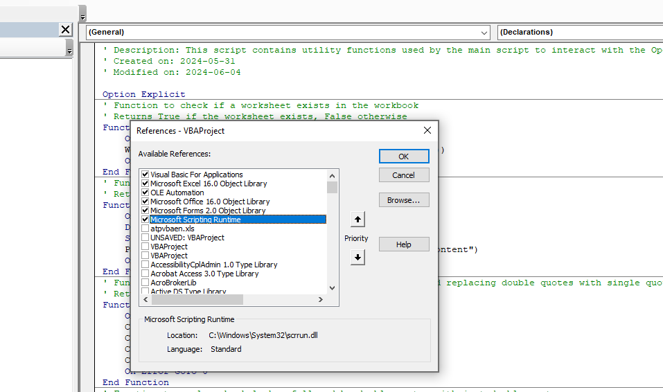
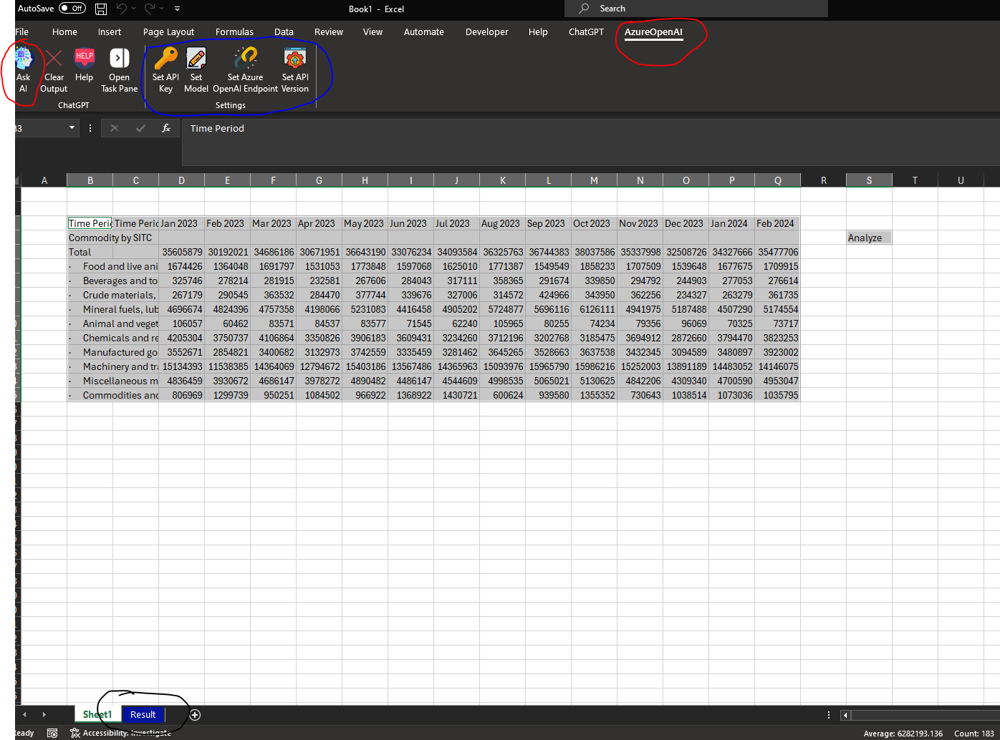
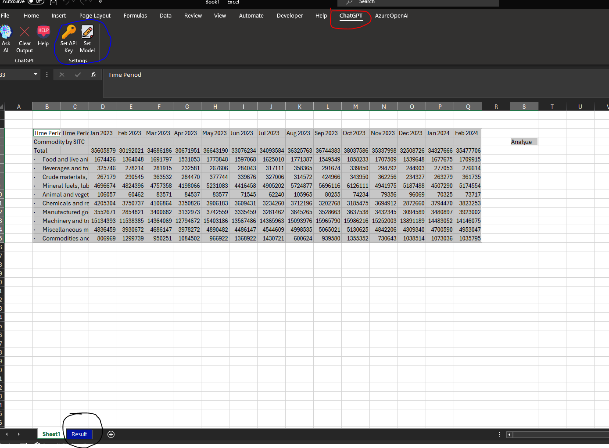

# GPT-Excel Add In 
 Excel based addins linked to external sources via API
 <br /><br />

<!-- badges: start -->
&nbsp;&nbsp;
[](https://chat.openai.com)&nbsp;&nbsp;
[](https://github.com/Ads2024/GPT-Excel-Add-In/blob/main/LICENSE)&nbsp;&nbsp;
&nbsp;&nbsp;
[](https://openai.com)&nbsp;&nbsp;
<!-- badges: end -->

<!-- DESCRIPTION -->

## 1. Description
There two excel add-ins in this repo: 
```The AI_Plugin``` - This plugin links with ChatGPT  by requring users to input their API key which can be obtained from **Chat Plyaground - OpenAI API**
```Azure_GPT_Addin``` - This plugin links with AzureOpenAI by requiring users to input their API key, endpoint, deployment model and API version.

<br />
<!-- GETTING STARTED -->

## 2. Getting started
### 2.1 Dependancies
- To use the ```AI_Plugin``` an OpenAI API key is required (create an account and get API Key at <a href="https://chat.openai.com">https://chat.openai.com</a>)
- To use the ```Azure_GPT_Addin``` an Azure OPENAI service is required with an already deployed model (see here: <a href="https://azure.microsoft.com/en-au/products/ai-services/openai-service">https://azure.microsoft.com/en-au/products/ai-services/openai-service</a>)
- To modify the plugins you can use the office ribbonx editor to make changes on the xml (see here: <a href="https://github.com/fernandreu/office-ribbonx-editor">https://github.com/fernandreu/office-ribbonx-editor"</a>)
- The JsonConverter was used to run the addin can be accessed here (see here: <a href="https://github.com/VBA-tools/VBA-JSON">https://github.com/VBA-tools/VBA-JSON</a>)

### 2.2 Editing
- Visual Studio Code (<a href="https://code.visualstudio.com/">https://code.visualstudio.com/</a>)
- Microsoft Visual Basic for Applications - ensure the below references are used to run, particularly the Microsoft Scripting Runtime.


### 2.3 Repo Structure
This repository contains the two plugins allong with their respective sripts, the ```The AI_Plugin```  corresponds to **OpenAI-CGPT** script folder and ```Azure_GPT_Addin``` corresponds to **AzureOpenAI** script folder.
   
    ├── assets
    ├── plugins
    │   ├── AI_Plugin.xlam
    │   │   
    │   └── Azure_GPT_Addin.xlam
    ├── scripts
    │   ├── AzureOpenAI
    │   │   ├── modGlobals.bas 
    |   |   ├── modMain.bas
    |   |   ├── modRibbon.xml
    |   |   ├── modUI.bas
    |   |   ├── modUtilities.bas 
    │   └── OpenAI-CGPT
    |   │   ├── modGlobals.bas
    |   |   ├── modMain.bas
    |   |   ├── modRibbon.xml
    |   |   ├── modUI.bas
    |   |   ├── modUtilities.bas

<br />

<!-- INSTRUCTIONS -->
## 3. How To Use

Lets begin with the ```Azure_GPT_Addin``` followed by the ```AI_Plugin```

### 3.1 Azure_GPT_Addin
To use this addin effectively ensure to complete all the necessary settings as circled in red in the image.
  - SetAPIkey : This setting would need to done prior to usage
  - Set Model : This would be our **Deployment Name** not the actual gpt model
  - Set Azure Endpoint: This will be url endpoint provided to you when deploying you application.
  - Set API : This will default to **2024-02-15-preview** and can be changed if this version deprecates (see here <a href='https://learn.microsoft.com/en-us/azure/ai-services/openai/reference'>https://learn.microsoft.com/en-us/azure/ai-services/openai/reference</a> ).

Once the settings is completed, you should select the the data to be queried and click on the Ask AI icon, The results of the query will be displayed in a separate sheet called Results.



### 3.2 AI_Plugin
To use this addin effectively ensure to complete all the necessary settings as circled in red in the image.
  - SetAPIkey : This setting would need to done prior to usage
  - Set Model: This would be the GPT model to use such as GPT-4o, note the default model is gpt-3.5-turbo which can be changed


Please be aware of the [costs](https://openai.com/pricing) associated with using the OpenAI API when using this addin.


<!-- OpenAI API Rate Limits -->

## 4. OpenAI Rate Limits
Rate limits are restrictions that OpenAI API imposes on the number of times a user or client can access their services within a specified period of time. (See for more detail <a href='https://platform.openai.com/docs/guides/rate-limits'>https://platform.openai.com</a>)

## Note also the Max tokens used for both plugins is 1024, this can be changed in modMain in both plugins
